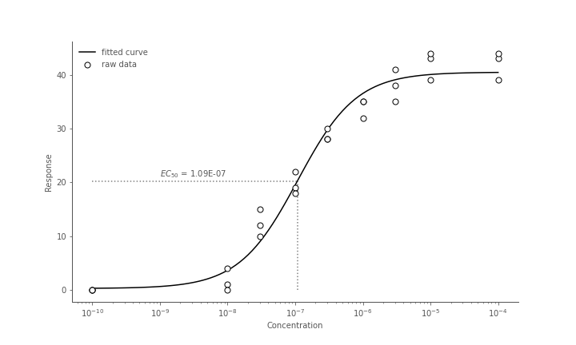
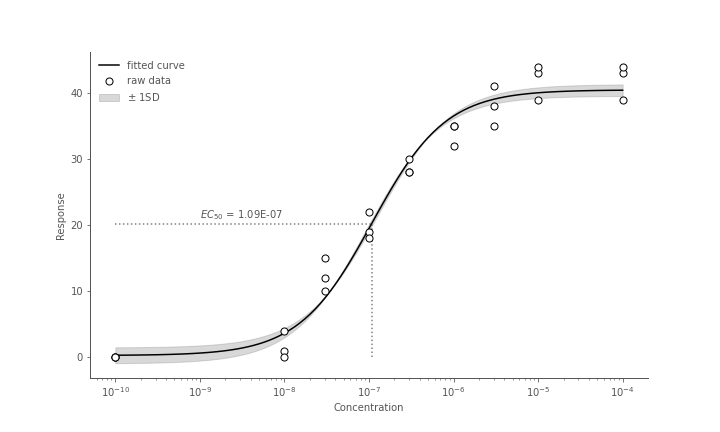
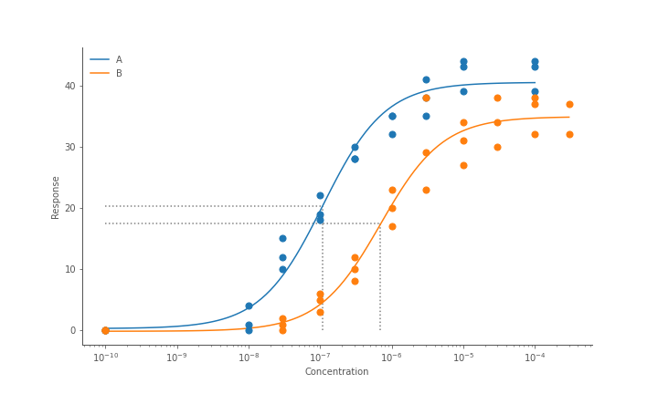

# Fitting concentration response curves

Fitting dose or concentration response curves is a common but nuanced task. To do this in python
we can define the curve fitting function in numpy, and use [`scipy.optimize.curve_fit()`](https://docs.scipy.org/doc/scipy/reference/generated/scipy.optimize.curve_fit.html) to fit a curve to our data.


## 3 parameter curve

### Concentration

```python
import numpy as np

def hill_3_param(
    x: np.ndarray, top: float, botton: float, ec50: float
) -> np.ndarray:
    return bottom + x * (top - bottom) / (ec50 + x)
```

### log concentrations

```python
def hill_3_param(
    x: np.ndarray, top: float, botton: float, log_ec50: float
) -> np.ndarray:
    return bottom + (top - bottom)  / (1 + 10**(log_ec50 - x))
```


## 4 parameter curve

### Concentration

```python
import numpy as np

def hill_4_param(
    x: np.ndarray, top: float, bottom: float, ec50: float, hillslope: float
) -> np.ndarray:
    numerator = bottom + (x**hillslope) * (top - bottom)
    denominator = ((x**hillslope) + (ec50**hillslope))
    return numerator / denominator
```

### log concentrations

```python
def hill_4_param(
    x: np.ndarray, top: float, bottom: float, log_ec50: float, hillslope: float
) -> np.ndarray:
    return bottom + (top - bottom) / (1 + 10**((log_ec50 - x) * hillslope))
```


## Fitting the model

At it's simplest, assuming `x` is an array of concentrations and `y` is an array of
corresponding responses, we can run:
```python
popt, pcov = scipy.optimize.curve_fit(hill_3_param, x, y)
```

This returns `popt`, which are the fitted [`top`, `bottom`, `ec50`, `hillslope` (if 4 parameter)]
values for your model. These can be used directly such as the $EC_{50}$, or used
with interpolated data to plot a curve.

`pcov` is the covariance of your parameter estimates which can be used to calculate
the standard deviation of your $EC_{50}$ for instance.


### Adjusting the curve fitting

You might find the curve fitting hasn't worked particularly well with the default
settings, in this case it often helps to adjust some parameters in `scipy.optimize.curve_fit()`.

#### `p0`

`p0` serves as the initial starting point for your model parameters. The closer
these are expected values, the easier the job the curve fitting algorithm will have.
If you don't specify starting points for `p0`, they will start as 1 for all values.


```python
p0 = [100, 0, 1e-3]  # starting point for [top, bottom, ec50] params
popt, pcov = scipy.optimize.curve_fit(hill_3_param, x, y, p0=p0)
```

#### `bounds`

You often have some idea if the parameters the curve fitting produces are
at all possible given your assay. For example a negative hill-slope, or a `bottom`
values less than 0. We can specify upper and lower bounds in the curve fitting
with the `bounds` argument. These should be fairly relaxed, but within
the realms of possibility.

```python
p0 = [100, 0, 1e-3]
bounds = (
  (0, 0, 0),     # lower bounds for [top, bottom, ec50]
  (300, 300, 1)  # upper bounds for [top, bottom, ec50]
)
popt, pcov = scipy.optimize.curve_fit(hill_3_param, x, y, p0=p0, bounds=bounds)
```

If you want to specify bounds for some parameters but leave others boundless,
use `-np.inf` and `np.inf`.


E.g here we set upper and lower bounds for the `top` and `bottom` parameters,
but allow `ec50` to be fit to any value.
```python
bounds = (
  (0, 0, -np.inf),     
  (300, 300, np.inf) 
)
popt, pcov = scipy.optimize.curve_fit(hill_3_param, x, y, bounds=bounds)
```

!!! note

    If you set `bounds`, you should be aware of the default values of
    `p0` being initialised as 1. If your bounds do not cover 1 then your model will
    fail to fit. So it's probably wise to set values for `p0` if you're also
    setting `bounds`.


## `pcov` and parameter uncertainty

The `pcov` object returned on `scipy.optimize.curve_fit()` is an n by n matrix
of estimated parameter covariances, where n is the number of parameters in your
model. We can use the diagonal of this matrix to get the estimated standard
deviation of our parameters.

```python
popt, pcov = scipy.optimize.curve_fit(hill_3_param, x, y)

p_err = np.sqrt(np.diag(pcov))
```

Since our `hill_3_param` model has 3 parameters, `p_err` will now the variance
of those 3 parameters in the same order as their arguments in the original
function (top, bottom, ec50).

```python
print(f"EC50 = {popt[2]} ({p_err[2]} std. dev.)")
```

## Plotting concentration response curves

Using example data from [here](https://gist.githubusercontent.com/Swarchal/f853a013cb5c055343b3c0efbf0b79ba/raw/8768cc544d80c0314ab710151b3d16a5801bb346/conc_response.csv), we'll fit and plot a 3 parameter concentration response curve.


### Generating interpolated points

Given our parameters from our fitted model, we can now generate an estimated response
value for any given concentration.


```python
import numpy as np
import pandas as pd
from scipy.optimize import curve_fit


def hill_3_param(
    x: np.ndarray, top: float, botton: float, ec50: float
) -> np.ndarray:
    return bottom + x * (top - bottom) / (ec50 + x)


# read in example concentration response data
df = pd.read_csv("conc_response.csv").dropna()
df_a = df[df["drug"] == "A"]

conc = df_a["conc"].to_numpy()
response = df_a["response"].to_numpy()

popt, pcov = curve_fit(hill_3_param, x=con, y=response)
top, bottom, ec50 = popt
```

We now have our parameters of our 3 parameter model (top, bottom, ec50):
```
[4.05044597e+01 3.22471271e-01 1.10047765e-07]
```


Now we generate 100 interpolated values between our minimum and maximum concentration
values to plot a smoother curve.

```
x_interpolated = np.logspace(min(np.log10(conc)), max(np.log(conc)), 100)
y_interpolated = hill_3_param(x_interpolated, *popt)
```


### Plotting with matplotlib

Now we can plot both the raw data points and the fitted curve in matplotlib.

```python
plt.plot(x_interpolated, y_interpolated, label="fitted curve", color="black")
plt.scatter(
    conc, response, label="raw data", color="black", facecolor="white", zorder=99
)
plt.vlines(x=ec50, ymin=0, ymax=top/2, linestyle="dotted", color="gray")
plt.hlines(y=top/2, xmin=min(conc), xmax=ec50, linestyle="dotted", color="gray")
plt.text(x=1e-9, y=23, s=f"$EC_{{50}} = {ec50:.2E}$")
plt.xlabel("Concentration")
plt.ylabel("Response")
plt.xscale("log")
plt.legend()
```




### Plotting standard deviations with `pcov`

As mentioned in the curve fitting section we can get the standard deviations of
our curve parameters from the `pcov` matrix.

```python
p_err = np.sqrt(np.diag(pcov))
```

We can then plot this uncertainty on the curve by calculating 2 additional curves,
one with our parameters + standard deviation, and another - standard deviation.
Then we can use `plt.fill_between()` to fill the area between the upper and lower
bounded curves.

```python
y_hat_upper = hill_3_param(
    x_interpolated, top+p_err[0], bottom+p_err[1], ec50+p_err[2]
)
y_hat_lower = hill_3_param(
    x_interpolated, top-p_err[0], bottom-p_err[1], ec50-p_err[2]
)

plt.plot(x_interpolated, y_interpolated, label="fitted curve", color="black")
plt.scatter(
    conc, response, label="raw data", color="black", facecolor="white", zorder=99
)
plt.fill_between(
    x_interpolated,
    y1=y_hat_upper,
    y2=y_hat_lower,
    color="gray",
    alpha=0.3,
    label="$\pm$ 1SD"
)
plt.vlines(x=ec50, ymin=0, ymax=top/2, linestyle="dotted", color="gray")
plt.hlines(y=top/2, xmin=min(conc), xmax=ec50, linestyle="dotted", color="gray")
plt.text(x=1e-9, y=23, s=f"$EC_{{50}} = {ec50:.2E}$")
plt.xlabel("Concentration")
plt.ylabel("Response")
plt.xscale("log")
plt.legend()
```



### Plotting multiple curves

If we're plotting multiple curves it's worth writing some functions so we
don't have to repeat lots of curves for each drug.

Since our data is in the form of a dataframe, we can split by the `drug` column
and loop through the different drugs, calculating the curve fitting parameters and plot
each one in turn

```python
from typing import NamedTuple

class Params(NamedTuple):
    top: float
    bottom: float
    ec50: float


class ModelFit(NamedTuple):
    x_raw: np.ndarray
    y_raw: np.ndarray
    x_interp: np.ndarray
    y_fit: np.ndarray
    params: Params


def fit_3_param_curve(df: pd.DataFrame) -> ModelFit:
    x = df["conc"].to_numpy()
    y = df["response"].to_numpy()
    popt, pcov = curve_fit(hill3param, x, y)
    x_interp = np.logspace(min(np.log10(x)), max(np.log10(x)), 100)
    y_fit = hill3param(x_interp, *popt)
    return ModelFit(x, y, x_interp, y_fit, Params(*popt))


def plot_3_param_curve(model_fit: ModelFit):
    params = model_fit.params
    plt.plot(model_fit.x_interp, model_fit.y_fit, label=name)
    plt.scatter(model_fit.x_raw, model_fit.y_raw, s=50, zorder=999)
    plt.vlines(
        x=params.ec50, ymin=0, ymax=params.top/2, linestyle="dotted", color="gray"
    )
    plt.hlines(
        y=params.top/2, xmin=min(x), xmax=params.ec50, linestyle="dotted", color="gray"
    )
    

plt.figure(figsize=[10, 6])
for name, group in df.groupby("drug"):
    model_fit = fit_3_param_curve(group)
    plot_3_param_curve(model_fit)
plt.xlabel("Concentration")
plt.ylabel("Response")
plt.xscale("log")
plt.legend(title="Drug", loc="upper left")
```


