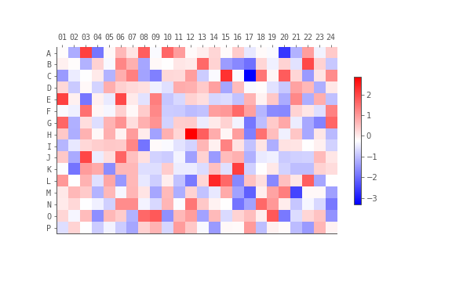

# Plates

If we consider a single plate, we can represent it in 2 main ways:

- A mapping of well-labels to values
- A 2D array representing values in the dimensions of a plate.

## Mapping well label to values


### DataFrame
```python
from string import ascii_uppercase

import pandas as pd
import numpy as np

# make well labels
rows = ascii_uppercase[:16]
cols = range(1, 25)
wells = [f"{r}{c:02}" for r in rows for c in cols]
values = np.random.randn(384)  # just random data

plate_df = pd.DataFrame({"well": wells, "val": values})
plate_df.head()
```

|   | well | val   |
|---|------|-------|
| 0 | A01  | 0.454 |
| 1 | A02  | 0.195 |
| 2 | A03  | 1.639 |
| 3 | A04  | 0.831 |
| 4 | A05  | 0.277 |
...

Dataframes are probably the most useful format as pandas enables easy
transformations such as merging, filtering, sorting etc.

### Dictionary
```python
plate_dict = {well: val for well, val in zip(wells, values)}

# print out first couple of well:value pairs
for well, value in list(plate_dict.items())[:5]:
    print(well, value, sep=": ")
```

```
> A01: -0.5348518247234555
> A02: -1.0802744081971545
> A03: -0.23594497461538594
> A04: -0.4214463113386894
> A05: -0.37864853878757504
```

Or look up a value for a single well
```python
plate_dict["A01"]
> -0.5348518247234555
```

## Plate arrays

If we want to convert a Dataframe of a plate into a 2D array:

```python
plate_arr = np.empty((16, 24), dtype=float)
plate_arr[:] = np.nan  # set all values to missing

for _, well, value in plate_df.itertuples():
    # get row, column indices from well label (0 indexed)
    row_pos = ord(well[0])-65
    col_pos = int(well[1:]) - 1
    # assign value to this index in array
    plate_arr[row_pos, col_pos] = value
```

## Plotting a plate

With plates in their 2D array format, it is now very easy to plot these
as a platemap with matplotlib.

```python
import matplotlib.pyplot as plt

fig, ax = plt.subplots(figsize=[8, 5])
plt.imshow(plate_arr, origin="upper", cmap="bwr")
plt.colorbar(shrink=0.6)

# display row and column labels
plt.yticks(range(16), ascii_uppercase[:16], fontfamily="monospace")
plt.xticks(range(24), [f"{i:02}" for i in range(1, 25)], fontfamily="monospace")
# move column labels to top
ax.xaxis.tick_top()
plt.show()
```


