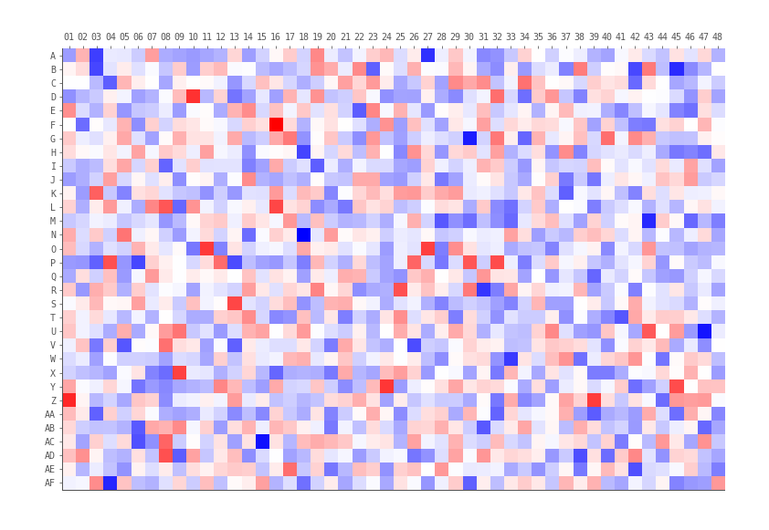

# Wells

## Creating well labels from row and column positions

If we have row and column positions, we can convert these into well-labels.

```python
from string import ascii_uppercase


def row_col_to_well(row: int, col: int) -> str:
    return f"{ascii_uppercase[row-1]}{col:02}" 
```

```python
row_col_to_well(1, 1)
> "A01"
```


## Row and column positions from well labels


```python
def well_to_row_col(well: str) -> tuple[int, int]:
    row = ord(well[0].upper()) - 64
    col = int(well[1:])
    return row, col
```

```python
well_to_row_col("A01")
> (1, 1)
```

The strange thing here is `ord(..) - 64` , what is ord, and why subtract 64?
`ord()` converts a character into it's unicode integer representation, and for
unimportant reasons "A" is 65. So if you want A = 1, B = 2, etc, subtract 64.
 

Instead of just returning a tuple, we can use a `NamedTuple`, so we can access
the row and column values by name, rather than position.

```python
from typing import NamedTuple


class Well(NamedTuple):
    label: str
    row: int
    column: int


def make_well(well: str) -> Well:
    row, column = well_to_row_col(well)
    return Well(well, row, column)
```

```python
make_well("A01")
>  Well(label='A01', row=1, column=1)
```

## Zero padding well labels

Wells are typically zero-padded, such as "A01" rather than "A1", but we sometimes
have to convert well labels between the two.

This uses python string formatting, which can handily format integers as strings
with zero padding for us.

```python
def pad_well(well: str) -> str:
    row = well[0]
    col = int(well[1:])
    return f"{row}{col:02}"
```

```python
pad_well("A1")
> "A01"
```

So the magic is done in `{col:02}`. This means the `col` number, and everything
after the colon is the fomatting specifications, in this case we want 2 digits,
zero-padded if necessary `:02`.

Unpadding wells is almost identical, except we don't specify any special formatting
in `{col}`.

```python
def unpad_well(well: str) -> str:
  row = well[0]
  col = int(well[1:])
  return f"{row}{col}"
```

```python
unpad_well("A01")
> "A1"
```

## Generating a well labels

If we wanted to generate all the well labels in a 384-well plate:
```python
from string import ascii_uppercase

wells = [f"{r}{c:02}" for r in ascii_uppercase[:16] for c in range(1, 25)]
```

It's worth noting that python's `range(1, 25)` function is not inclusive of the
final number in the sequence, that's why we went to 25 and not 24.


## Wells from 1536 well plates

A 1536 well plate has 48 columns and 32 rows. The key difference is the 32 rows
which cannot be represented as a single alphabetical character. The most common
1536 well plate formats have rows which range from A-Z, and then continue from
AA until AF. So our previous python functions will break with wells from a
1536-well plate.



```python
from string import ascii_uppercase

def row_col_to_well(row: int, col: int) -> str:
    if row <= 26:
        row_letter = ascii_uppercase[row - 1]
    else:
        row_letter = "A" + ascii_uppercase[row % (26 + 1)]
    return f"{row_letter}{col:02}"
```

We now can't assume the first character of the well label corresponds to the
row, it might be one character (A-Z), or 2 character (AA-AF). But we can index 
the well label starting from the end, so we never have to worry about that. So
the last 2 characters (`well[-2:]`) are always the column (if zero-padded),
and from there until the start of the well-label (`well[:-2]`) is the row, whether it's
1 character or 2.

We then need to convert the row character(s) into an integer. Before we used
the `ord()` function to convert the character into a numerical representation.
Now we have to handle either "A" or "AA", which means either row 1 or row 27.
The simplest way is to check the length, if it's only 1 character, treat it the
usual way, if it's 2 characters, get the number of the last character and add 26
(or to save an operation, subtract 38 instead of the usual 64 from the `ord()`
function).


```python

def well_to_row_col(well: str) -> tuple[int, int]:
    col = int(well[-2:])  # last 2 characters as an integer
    row_char = well[:-2]  # up until the last 2 characters
    if len(row_char) == 1:
        row = ord(row_char.upper()) - 64
    else:
        row = ord(row_char[-1].upper()) - 38  # (65 - 26 = 38)
    return row, col
```

We could also solve this issue using [regular expressions](https://docs.python.org/3/library/re.html)
but they're usually more trouble than they're worth.
